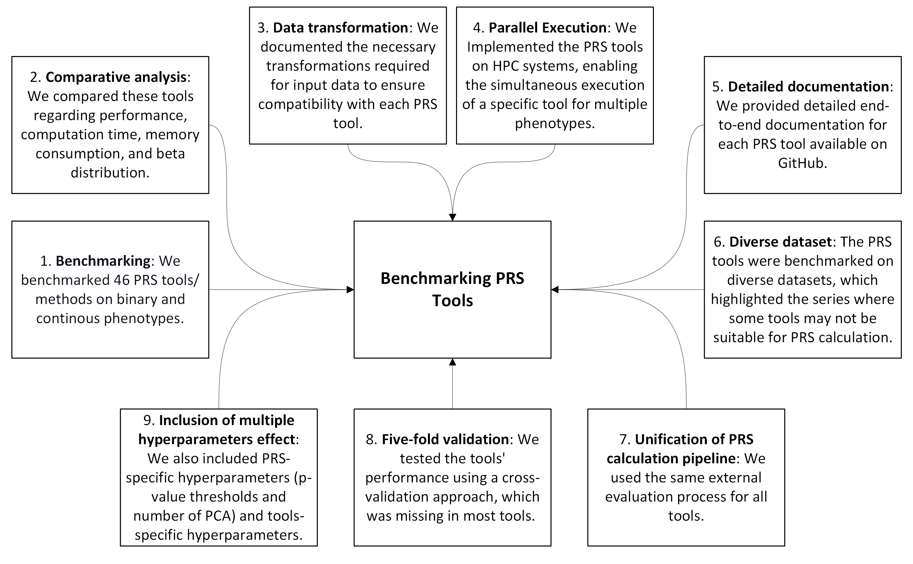
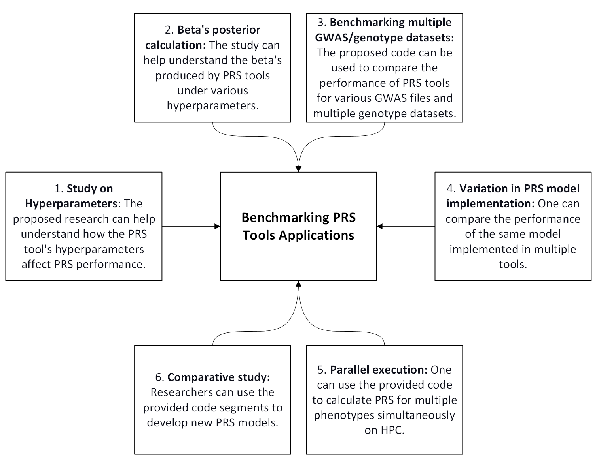
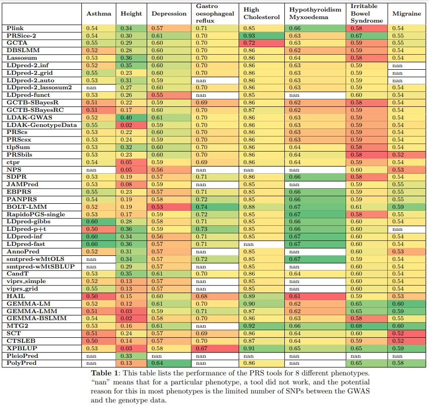

# Introduction - PRSTools

## Background

Online Repository:
https://muhammadmuneeb007.github.io/PRSTools/Introduction.html


While working on a manuscript focused on benchmarking machine learning algorithms for genotype-phenotype prediction, I received feedback recommending the inclusion of a broader analysis of PRS methodologies. This led me to investigate various PRS calculation tools used in genetic research, each of which applies unique approaches and assumptions that influence final PRS. These findings were supported by studies like [this one on PubMed](https://pubmed.ncbi.nlm.nih.gov/34243982/), which reviews the diversity in PRS tools.

The calculation of PRS depends on several factors:

- **Data Type Compatibility**: Some tools rely on GWAS summary statistics, others use genotype data, and some utilize both types.
- **Modeling Differences**: Tools apply different mathematical models, impacting PRS interpretation.
- **Reference Panels and Genome Builds**: PRS tools may require specific reference panels, which affect compatibility and generalizability.


### Key Challenges

Implementing PRS tools for practical analysis posed several challenges:

- **Data Format Incompatibility**: Different tools accept varying input formats, making data integration across tools challenging.
- **Limited Cross-Validation Support**: Many tools lack built-in cross-validation functionality, essential for robust model validation.
- **HPC Scalability Constraints**: Some tools are not optimized for high-performance computing (HPC), limiting scalability for analyses across multiple phenotypes.

## Repository Overview

To address these challenges, we created a new repository that provides a unified implementation of PRS calculation tools with enhancements for usability in real-world research settings. Key features include:

1. **Benchmarking**: We benchmarked 46 PRS tools/methods on both binary and continuous phenotypes.
2. **Comparative Analysis**: Performance, computation time, memory consumption, and beta distribution of each tool were compared.
3. **Data Transformation**: Documentation on the necessary input data transformations ensures compatibility across PRS tools.
4. **Parallel Execution**: Tools were implemented for parallel execution on HPC systems, enabling simultaneous analyses across multiple phenotypes.
5. **Detailed Documentation**: Comprehensive end-to-end documentation for each PRS tool is available on GitHub.
6. **Diverse Dataset Testing**: PRS tools were benchmarked on diverse datasets, revealing specific tools' limitations for certain data types.
7. **Unified PRS Calculation Pipeline**: A standardized evaluation process was applied across all tools.
8. **Cross-Validation Implementation**: Five-fold cross-validation was incorporated to assess tool performance, an often-missing feature.
9. **Hyperparameter Tuning**: PRS-specific hyperparameters (e.g., p-value thresholds, PCA counts) and tool-specific hyperparameters were included to optimize PRS accuracy.




## Conclusion

In summary, this repository addresses some limitations in current PRS tools, providing researchers with an adaptable and efficient solution for polygenic risk score calculations. By improving compatibility, scalability, and documentation, the repository supports large-scale genetic studies and promotes broader use of PRS methodologies in research.




## PRS Tools Included in the Analysis.

Following is the list of PRS tools included in the analysis.

 


| Tool              | Python | Conda Environment | Tool Link                                                                                       | Phenotype (Binary/Continuous/Both) | Requires Genotype data                                 | Requires GWAS data | Requires Covariate data | Requires Reference data                | Dependence                    | Language       | Original article DOI                                |
|-------------------|--------|-------------------|-------------------------------------------------------------------------------------------------|------------------------------------|-------------------------------------------------------|--------------------|--------------------------|-----------------------------------------|--------------------------------|----------------|-----------------------------------------------------|
| Plink             | 3      | genetics         | [Plink 1.9](https://www.cog-genomics.org/plink/1.9/score)                                       | Both                               | Yes                                                   | Yes                | No                       | No                                      | No                             | C              | [10.1086/519795](https://doi.org/10.1086/519795)    |
| PRSice-2          | 3      | genetics         | [PRSice-2](https://github.com/choishingwan/PRSice)                                              | Both                               | Yes                                                   | Yes                | Optional                 | Optional, but recommended               | No                             | C++ and R      | [10.1093/gigascience/giz082](https://doi.org/10.1093/gigascience/giz082) |
| GCTA              | 3      | genetics         | [GCTA SBLUP](https://yanglab.westlake.edu.cn/software/gcta/#SBLUP)                              | Both                               | Yes                                                   | Yes                | No                       | No                                      | Plink (PRS calculation)        | C++            | [10.1007/978-1-62703-447-0_9](https://doi.org/10.1007/978-1-62703-447-0_9) |
| DBSLMM            | 3      | genetics         | [DBSLMM](https://github.com/biostat0903/DBSLMM)                                                 | Both                               | No (optional, can be used as reference panel)         | Yes                | No                       | Optional, but recommended               | Plink (PRS calc), LDpred-2 (Heritability calc) | C++ and R      | [10.1016/j.ajhg.2020.03.013](https://doi.org/10.1016/j.ajhg.2020.03.013) |
| lassosum          | 3      | genetics         | [lassosum](https://rdrr.io/github/tshmak/lassosum/man/lassosum.html)                            | Both                               | Yes                                                   | Yes                | No                       | Yes                                     | Plink (PRS calculation)        | R              | [10.1002/gepi.22050](https://doi.org/10.1002/gepi.22050) |
| ldpred2_inf       | 3      | genetics         | [LDpred2 inf](https://privefl.github.io/bigsnpr/articles/LDpred2.html)                          | Both                               | Yes                                                   | Yes                | No                       | Yes                                     | Plink (PRS calculation)        | R              | [10.1093/bioinformatics/btaa1029](https://doi.org/10.1093/bioinformatics/btaa1029) |
| ldpred2_grid      | 3      | genetics         | [LDpred2 grid](https://privefl.github.io/bigsnpr/articles/LDpred2.html)                         | Both                               | Yes                                                   | Yes                | No                       | Yes                                     | Plink (PRS calculation)        | R              | [10.1093/bioinformatics/btaa1029](https://doi.org/10.1093/bioinformatics/btaa1029) |
| ldpred2_auto      | 3      | genetics         | [LDpred2 auto](https://privefl.github.io/bigsnpr/articles/LDpred2.html)                         | Both                               | Yes                                                   | Yes                | No                       | Yes                                     | Plink (PRS calculation)        | R              | [10.1093/bioinformatics/btaa1029](https://doi.org/10.1093/bioinformatics/btaa1029) |
| ldpred2_lassosum2 | 3      | genetics         | [LDpred2 lassosum2](https://privefl.github.io/bigsnpr/articles/LDpred2.html)                    | Both                               | Yes                                                   | Yes                | No                       | Yes                                     | Plink (PRS calculation)        | R              | [10.1093/bioinformatics/btaa1029](https://doi.org/10.1093/bioinformatics/btaa1029) |
| ldpred-funct      | 2      | ldscc             | [LDpred-funct](https://github.com/carlaml/LDpred-funct)                                         | Both                               | Yes                                   | Yes                | No                       | Yes                             | Plink (PRS calc), LDpred-2 (Heritability calc) | Python         | [10.1038/s41467-021-25171-9](https://doi.org/10.1038/s41467-021-25171-9) |
| SBayesR           | 3      | genetics         | [SBayesR](https://cnsgenomics.com/software/gctb/#Download)                                      | Both                               | Yes - To create an LD matrix          | Yes                | No                       | Yes - LD Matrix                 | Plink (PRS calculation)        | C++            | [10.1038/s41588-024-01704-y](https://doi.org/10.1038/s41588-024-01704-y) |
| SBayesRC          | 3      | genetics         | [SBayesRC](https://cnsgenomics.com/software/gctb/#Download)                                     | Both                               | Yes - To create an LD matrix          | Yes                | No                       | Yes - LD Matrix                 | Plink (PRS calculation)        | C++            | [10.1038/s41467-019-12653-0](https://doi.org/10.1038/s41467-019-12653-0) |
| LDAK-genotype     | 3      | genetics         | [LDAK-genotype](https://dougspeed.com/quick-prs/)                                               | Both                               | Yes                                   | No                 | No                       | No                              | Plink (PRS calculation)        | C++            | [10.1038/s41467-021-24485-y](https://doi.org/10.1038/s41467-021-24485-y) |
| LDAK-gwas         | 3      | genetics         | [LDAK-gwas](https://dougspeed.com/quick-prs/)                                                   | Both                               | Yes                                   | Yes                | No                       | Yes - Correlation Matrix        | Plink (PRS calculation)        | C++            | [10.1038/s41467-021-24485-y](https://doi.org/10.1038/s41467-021-24485-y) |
| PRScs             | 3      | genetics         | [PRScs](https://github.com/getian107/PRScs)                                                     | Both                               | Yes                                   | Yes                | No                       | Yes - LD Matrix                 | Plink (PRS calculation)        | Python         | [10.1038/s41467-019-09718-5](https://doi.org/10.1038/s41467-019-09718-5) |
| PRScsx            | 3      | genetics         | [PRScsx](https://github.com/getian107/PRScsx)                                                   | Both                               | Yes                                   | Yes                | No                       | Yes - LD Matrix                 | Plink (PRS calculation)        | Python         | [10.1038/s41588-022-01054-7](https://doi.org/10.1038/s41588-022-01054-7) |
| tlpSum            | 3      | genetics         | [tlpSum](https://github.com/jpattee/penRegSum)                                                  | Both                               | Yes                                   | Yes                | No                       | Yes                             | Plink (PRS calculation)        | R              | [10.1371/journal.pcbi.1008271](https://doi.org/10.1371/journal.pcbi.1008271) |
| PRSbils           | 3      | genetics         | [PRSbils](https://github.com/styvon/PRSbils)                                                    | Both                               | Yes                                   | Yes                | No                       | Yes                             | Plink (PRS calculation)        | Python         |                                                          |
| CTPR              | 3      | genetics         | [CTPR](https://github.com/wonilchung/CTPR)                                                      | Both                               | Yes                                   | Yes                | No                       | No                              | Plink (PRS calculation)        | C++            | [10.1038/s41467-019-08535-0](https://doi.org/10.1038/s41467-019-08535-0) |
| NPS                | 3      | genetics         | [NPS](https://github.com/sgchun/nps)                                                            | Both                               | Yes                                   | Yes                | No                       | No                              | Plink (PRS calculation)        | R              | [10.1016/j.ajhg.2020.05.004](https://doi.org/10.1016/j.ajhg.2020.05.004) |
| SDPR               | 3      | genetics         | [SDPR](https://github.com/eldronzhou/SDPR.git)                                                  | Both                               | Yes - To create an LD matrix          | Yes                | No                       | No                              | Plink (PRS calculation)        | C++            | [10.1371/journal.pgen.1009697](https://doi.org/10.1371/journal.pgen.1009697) |
| JAMPred            | 3      | genetics         | [JAMPred](https://rdrr.io/github/pjnewcombe/R2BGLiMS/man/JAMPred.html)                          | Both                               | No                                    | Yes                | No                       | No                              | Plink (PRS calculation)        | R              | [10.1002/gepi.22245](https://doi.org/10.1002/gepi.22245) |
| EB-PRS             | 3      | genetics         | [EB-PRS](https://github.com/shuangsong0110/EBPRS)                                               | Both                               | Yes                                   | No                 | No                       | No                              | Plink (PRS calculation)        | R              | [10.1371/journal.pcbi.1007565](https://doi.org/10.1371/journal.pcbi.1007565) |
| PANPRS             | 3      | genetics         | [PANPRS](https://github.com/cran/PANPRSnext)                                                    | Both                               | Yes - As LD matrix                    | Yes                | No                       | Yes - LD Matrix                 | Plink (PRS calculation)        | R              | [10.1080/01621459.2020.1764849](https://doi.org/10.1080/01621459.2020.1764849) |
| BOLT-LMM           | 3      | genetics         | [BOLT-LMM](https://alkesgroup.broadinstitute.org/BOLT-LMM/BOLT-LMM_manual.html#x1-470008)       | Both                               | Yes                                   | No                 | Yes                      | Yes                             | Plink (PRS calculation)        | C++            | [10.1038/ng.3190](https://doi.org/10.1038/ng.3190) |
| RapidoPGS-single   | 3      | AdvanceR         | [RapidoPGS-single](https://github.com/GRealesM/RapidoPGS)                                       | Both                               | No                                    | Yes                | No                       | No                              | Plink (PRS calculation)        | R              | [10.1093/bioinformatics/btab456](https://doi.org/10.1093/bioinformatics/btab456) |
| LDpred-gibbs       | 3      | genetics         | [LDpred-gibbs](https://github.com/bvilhjal/ldpred)                                              | Both                               | Yes                                   | Yes                | No                       | Yes                             | Plink (PRS calculation)        | Python         | [10.1016/j.ajhg.2015.09.001](https://doi.org/10.1016/j.ajhg.2015.09.001) |
| LDpred-p+t         | 3      | genetics         | [LDpred-p+t](https://github.com/bvilhjal/ldpred)                                                | Both                               | Yes                                   | Yes                | No                       | Yes                             | Plink (PRS calculation)        | Python         | [10.1016/j.ajhg.2015.09.001](https://doi.org/10.1016/j.ajhg.2015.09.001) |
| LDpred-inf         | 3      | genetics         | [LDpred-inf](https://github.com/bvilhjal/ldpred)                                                | Both                               | Yes                                   | Yes                | No                       | Yes                             | Plink (PRS calculation)        | Python         | [10.1016/j.ajhg.2015.09.001](https://doi.org/10.1016/j.ajhg.2015.09.001) |
| LDpred-fast        | 3      | genetics         | [LDpred-fast](https://github.com/bvilhjal/ldpred)                                               | Both                               | Yes                                   | Yes                | No                       | Yes                             | Plink (PRS calculation)        | Python         | [10.1016/j.ajhg.2015.09.001](https://doi.org/10.1016/j.ajhg.2015.09.001) |
| Anno-Pred          | 2      | ldscc            | [Anno-Pred](https://github.com/yiminghu/AnnoPred)                                               | Both                               | Yes                                   | Yes                | No                       | Yes                             | Plink (PRS calculation)        | Python         | [10.1371/journal.pcbi.1005589](https://doi.org/10.1371/journal.pcbi.1005589) |
| smtpred-wMtOLS     | 2      | ldscc            | [smtpred-wMtOLS](https://github.com/uqrmaie1/smtpred)                                           | Both                               | Yes                                   | Yes                | No                       | Yes                             | Plink (PRS calculation)        | Python         | [10.1038/s41467-017-02769-6](https://doi.org/10.1038/s41467-017-02769-6) |
| smtpred-wMtSBLUP           | 2     | ldscc    | [GitHub](https://github.com/uqrmaie1/smtpred)                                                    | Both       | Yes            | Yes         | No          | Yes                  | Plink (PRS calculation)| Python   | [https://doi.org/10.1038/s41467-017-02769-6](https://doi.org/10.1038/s41467-017-02769-6) |
| C+T (Clumping and Thresholding) | 3     | genetics |                                                                                                | Both       | Yes            | Yes         | No          | No                   | Plink (PRS calculation)| Python   |                                          |
| viprs-simple               | 3     | viprs_env    | [GitHub](https://github.com/shz9/viprs-paper)                                                    | Both       | Yes            | Yes         | No          | Yes                  | Plink (PRS calculation)| Python   | [https://doi.org/10.1016/j.ajhg.2023.03.009](https://doi.org/10.1016/j.ajhg.2023.03.009) |
| viprs-grid                 | 3     | viprs_env    | [GitHub](https://github.com/shz9/viprs-paper)                                                    | Both       | Yes            | Yes         | No          | Yes                  | Plink (PRS calculation)| Python   | [https://doi.org/10.1016/j.ajhg.2023.03.009](https://doi.org/10.1016/j.ajhg.2023.03.009) |
| HAIL                       | 3     | genetics | [Notebook](https://nbviewer.org/github/ddbj/imputation-server-wf/blob/main/Notebooks/hail-prs-tutorial.ipynb) | Both       | Yes            | Yes         | No          | Yes                  | Plink (PRS calculation)| Python   | [https://doi.org/10.1038/s41588-023-01648-9](https://doi.org/10.1038/s41588-023-01648-9) |
| GEMMA-LM                   | 3     | genetics | [GitHub](https://github.com/genetics-statistics/GEMMA)                                           | Both       | Yes            | Yes         | Yes         | No                   | Plink (PRS calculation)| C++      | [https://doi.org/10.1038/ng.2310](https://doi.org/10.1038/ng.2310) |
| GEMMA-LLM                  | 3     | genetics | [GitHub](https://github.com/genetics-statistics/GEMMA)                                           | Both       | Yes            | Yes         | Yes         | No                   | Plink (PRS calculation)| C++      | [https://doi.org/10.1038/ng.2310](https://doi.org/10.1038/ng.2310) |
| GEMMA_BSLMM                | 3     | genetics | [GitHub](https://github.com/genetics-statistics/GEMMA)                                           | Both       | Yes            | Yes         | Yes         | No                   | Plink (PRS calculation)| C++      | [https://doi.org/10.1038/ng.2310](https://doi.org/10.1038/ng.2310) |
| MTG2                       | 3     | genetics | [Homepage](https://sites.google.com/view/s-hong-lee-homepage/mtg2)                               | Both       | Yes            | No          | Yes         | No                   | Plink (PRS calculation)| C++      | [10.1093/bioinformatics/btw012](https://doi.org/10.1093/bioinformatics/btw012) |
| SCT                        | 3     | genetics | [bigSNP](https://privefl.github.io/bigsnpr/articles/SCT.html)                                    | Both       | Yes            | Yes         | No          | No                   | Plink (PRS calculation)| R        | [https://doi.org/10.1016/j.ajhg.2019.11.001](https://doi.org/10.1016/j.ajhg.2019.11.001) |
| XP-BLUP                    | 3     | genetics | [GitHub](https://github.com/tanglab/XP-BLUP)                                                     | Both       | Yes            | No          | No          | No                   | Plink (PRS calculation)| Bash     | [10.5808/gi.21053](https://doi.org/10.5808/gi.21053) |
| CTSLEB                     | 3     | genetics | [GitHub](https://github.com/andrewhaoyu/CTSLEB)                                                 | Both       | Yes            | Yes         | No          | Yes                  | Plink (PRS calculation)| R        | [https://doi.org/10.1038/s41588-023-01501-z](https://doi.org/10.1038/s41588-023-01501-z) |
| PolyPred                   | 3     | polyfun | [Polyfun Wiki](https://github.com/omerwe/polyfun/wiki/6.-Trans-ethnic-polygenic-risk-prediction-with-PolyPred) | Both       | Yes            | Yes         | No          | Yes                  | Plink (PRS calculation)| Python   | [10.1038/s41588-022-01036-9](https://doi.org/10.1038/s41588-022-01036-9) |
| Pleio-Pred                 | 2     | ldscc    | [GitHub](https://github.com/yiminghu/PleioPred)                                                 | Both       | Yes            | Yes         | No          | Yes                  | Plink (PRS calculation)| Python   | [10.1371/journal.pgen.1006836](https://doi.org/10.1371/journal.pgen.1006836) |


## Conda Environment

You may need to create the following Conda Environment to execute each file.


- **advanceR Environment**  
  [Download environment.yml](CondaEnvironmentsForPRSTools/advanceR/environment.yml)  
  [Download replication_instructions.txt](CondaEnvironmentsForPRSTools/advanceR/replication_instructions.txt)

- **genetics Environment**  
  [Download environment.yml](CondaEnvironmentsForPRSTools/genetics/environment.yml)  
  [Download replication_instructions.txt](CondaEnvironmentsForPRSTools/genetics/replication_instructions.txt)

- **ldscc Environment**  
  [Download environment.yml](CondaEnvironmentsForPRSTools/ldscc/environment.yml)  
  [Download replication_instructions.txt](CondaEnvironmentsForPRSTools/ldscc/replication_instructions.txt)

- **polyfun Environment**  
  [Download environment.yml](CondaEnvironmentsForPRSTools/polyfun/environment.yml)  
  [Download replication_instructions.txt](CondaEnvironmentsForPRSTools/polyfun/replication_instructions.txt)

- **viprs_env Environment**  
  [Download environment.yml](
  CondaEnvironmentsForPRSTools/viprs_env/environment.yml)  
  [Download replication_instructions.txt](CondaEnvironmentsForPRSTools/viprs_env/replication_instructions.txt)


The following tools were discarded from further consideration for the following reasons:

- **Multiprs** – This methodology calculates PRS for multiple p-value thresholds and then combines them to form a single prediction. It is a methodolgy rather a tool.

- **BGLR-R** – While this software worked with its provided test data, it failed with our data, returning `NaN` for the explained variances across all phenotypes. This was despite our data matching the required format, with no missing genotype values for SNPs or individuals.

- **PolyRiskScore** – This is a web-based tool that calculates PRS for specific SNPs and uses GWAS files from the GWAS catalog. Due to its limited flexibility and dependency on specific SNPs, it was not suitable for our needs.

- **FairPRS** – Although promising, this tool writes output files to the same directory, making it incompatible with running multiple phenotypes or datasets simultaneously on HPC. The lack of parallel processing capability led us to exclude it from further consideration.

- **RapidoPGS-multi** – This tool did not support continuous phenotypes, though it worked for binary ones. Due to this limitation, it was removed from further consideration.


## Results




## Related Projects.

Here are some of the related projects that would be very helpful to researchers working on genetics, genotype-phenotype prediction, and risk scores.

| **Project Title**                                                                      | **Description**                                                                                                                                                                                                                                                                                                                                                                    | **GitHub Link**                                                                                   |
|----------------------------------------------------------------------------------------|------------------------------------------------------------------------------------------------------------------------------------------------------------------------------------------------------------------------------------------------------------------------------------------------------------------------------------------------------------------------------------|---------------------------------------------------------------------------------------------------|
| **GWASPokerforPRS**                                                                     | A meta-analysis and parsing tool designed for efficient polygenic risk score calculation using GWAS summary statistic files. This tool scans the GWAS Catalog, downloads metadata, parses GWAS files, and extracts necessary columns for PRS calculation, including DOI and citation details, helping to streamline the PRS calculation process. | [GitHub Link](https://github.com/MuhammadMuneeb007/GWASPokerforPRS)                              |
| **Identifying Genes Associated with Phenotypes Using Machine and Deep Learning**       | A project focused on leveraging machine and deep learning to identify genes associated with various phenotypes. This approach aims to uncover genetic associations that could enhance our understanding of phenotype-genotype relationships, using advanced computational techniques.                                                                 | [GitHub Link](https://github.com/MuhammadMuneeb007/Identifying-genes-associated-with-30-phenotypes-using-machine-deep-learning-) |
| **Benchmarking 80 OpenSNP Phenotypes Using Deep Learning Algorithms and PRS Tools**    | This project benchmarks 80 phenotypes from OpenSNP using deep learning algorithms and PRS tools. It aims to evaluate performance across various methods, providing insights into the effectiveness of different algorithms for PRS computation and phenotype prediction.                                                                | [GitHub Link](https://github.com/MuhammadMuneeb007/Benchmarking-80-OpenSNP-phenotypes-using-deep-learning-algorithms-and-polygenic-risk-scores-tools) |
| **Heritability Tools**                                                                  | A collection of tools for calculating heritability using diverse statistical methods and datasets, including GWAS summary statistics, genotype data, covariates, PCA, and reference panels. This project serves as a resource for researchers to estimate heritability under different modeling assumptions and statistical approaches.                  | [GitHub Link](https://github.com/MuhammadMuneeb007/heritability)                                  |

## Author Information.

- **Name**: Muhammad Muneeb  
- **Affiliation**: The University of Queensland  
- **Email**: [m.muneeb@uq.edu.au](mailto:m.muneeb@uq.edu.au)  
- **Gmail**: [muneebsiddique007@gmail.com](mailto:muneebsiddique007@gmail.com)  
- **GitHub**: [GitHub Profile](https://github.com/MuhammadMuneeb007/)  
- **Google Scholar**: [Google Scholar](https://scholar.google.com/citations?hl=en&user=X0xdltIAAAAJ&view_op=list_works&sortby=pubdate)  
- **ResearchGate**: [ResearchGate Profile](https://www.researchgate.net/profile/Muhammad-Muneeb-5)  
- **Supervisor**: [David Ascher](https://scmb.uq.edu.au/profile/8654/david-ascher)  
- **Group Webpage**: [BioSig Lab](https://biosig.lab.uq.edu.au/)


```python

```
